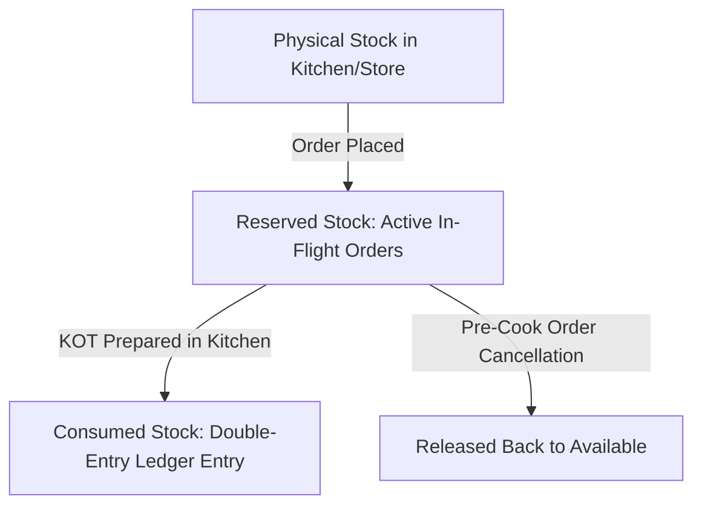

# INVENTORY_ENGINE.md — 3-Tier Stock Ledger, Recipe Yields & Negative Stock Protection

## 1. The 3-Tier Stock Model

To prevent race conditions when multiple waiters place simultaneous orders, inventory uses a 3-tier stock state:

$$\text{Available Stock} = \text{Physical Stock} - \text{Reserved Stock}$$

---

## 2. Recipe Consumption & Yield Factors

Kolhapuri Khanawal recipes support intermediate preparations with realistic yield factors:
- Raw Chicken (10 kg) $\xrightarrow{\text{Yield 75\%}}$ Cleaned & Marinated Chicken (7.5 kg)
- Indrayani Rice (15 kg) $\xrightarrow{\text{Yield 220\%}}$ Steamed Rice

### Chicken Thali Recipe Bill of Materials:
- **Fresh Chicken:** $0.100\text{ kg}$ ($100\text{ g}$)
- **Indrayani Rice:** $0.250\text{ kg}$ ($250\text{ g}$)
- **Toor Dal:** $0.150\text{ kg}$ ($150\text{ g}$)
- **Seasonal Bhaji:** $0.100\text{ kg}$ ($100\text{ g}$)
- **Chapati:** $2\text{ pieces}$
- **Groundnut Oil:** $0.015\text{ L}$ ($15\text{ ml}$)
- **Kolhapuri Masala:** $0.005\text{ kg}$ ($5\text{ g}$)

### Theoretical Portions Formula:
$$\text{Portions} = \min_{c \in \text{Components}} \left\lfloor \frac{\text{AvailableStock}_c}{\text{QuantityPerPortion}_c \times \text{YieldFactor}_c} \right\rfloor$$

---

## 3. Strict Negative Stock Protection

If an order requests more portions than available stock permits:
1. The transaction is immediately blocked.
2. The UI displays an actionable, staff-friendly error:
   `"Chicken stock is insufficient. Available: 700 g. Required: 900 g."`
3. If an authorized Manager or Owner overrides the block, an explicit immutable audit log is generated with user ID, override reason, and timestamp.
