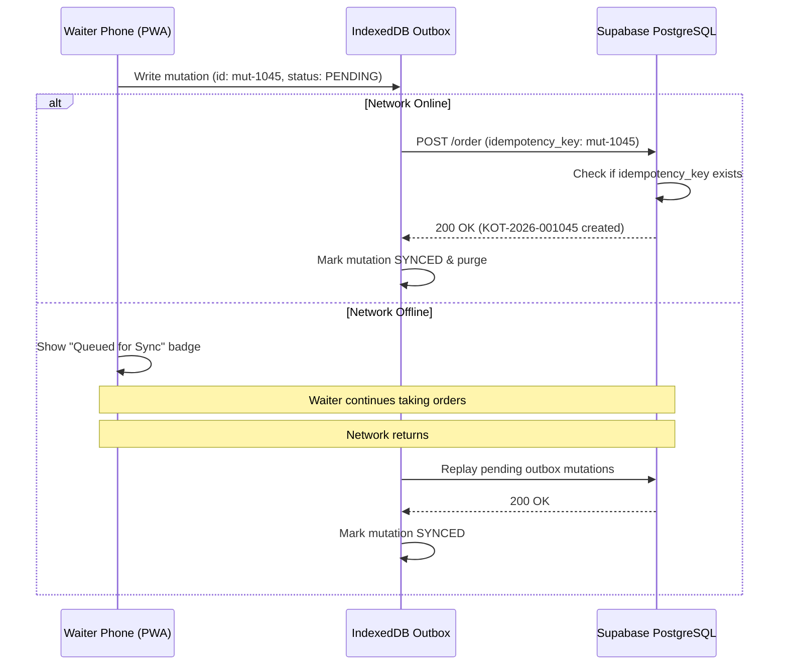

# OFFLINE_SYNC.md — IndexedDB Outbox & Idempotency Architecture

## 1. Outbox Pattern for Waiter PWA

In dynamic restaurant environments with fluctuating Wi-Fi and mobile hotspot signals, waiter devices must never freeze or lose orders:

1. **Client-Generated Mutation UUIDs:** Every mutation (e.g., `SEND_KOT`, `CREATE_PARTY`, `REQUEST_BILL`) receives an RFC-compliant client UUID (e.g. `mut-1725300000000-x9q8p1`).
2. **IndexedDB Local Storage:** Mutations are stored in the `outbox_mutations` object store before network submission.
3. **Connectivity Detection:** The application monitors `navigator.onLine` and displays a high-contrast connectivity badge:
   - `ONLINE` (Green)
   - `OFFLINE` (Red)
   - `SYNCING` (Amber Flash)
   - `SYNC FAILED` (Red Border)

---

## 2. Idempotent Synchronization Flow

---

## 3. Concurrency Deduplication Guarantee

If a waiter presses "SEND KOT", experiences a temporary network packet drop, and retries the button:
- The server checks `orders.idempotency_key = 'mut-1045'`.
- Since the order was already processed in the first attempt, the database returns the existing `order_id` and `kot_number` rather than creating duplicate orders or double-consuming stock.
