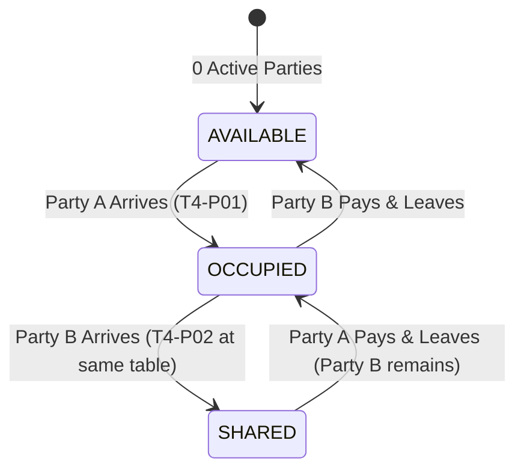
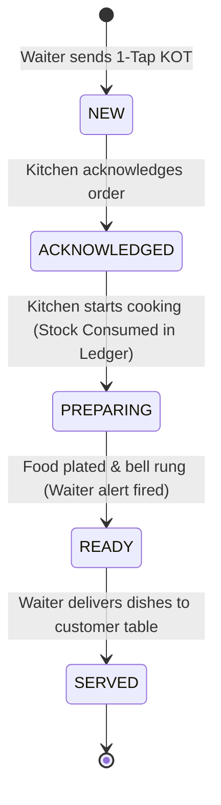

# RESTAURANT_WORKFLOWS.md — End-to-End Service Lifecycle

## 1. Physical Table & Shared Dining Party Lifecycle

---

## 2. Order & Kitchen Preparation Workflow

---

## 3. Billing & Payment Settlement Workflow

1. **Party Requests Bill:** Waiter taps "Request Bill" for Party `T6-P01`.
2. **Cashier Console:** Cashier selects `T6-P01`, applies authorized discount (with manager PIN if $> 10\%$).
3. **Tax & Round-Off:** Configurable GST (CGST 2.5% + SGST 2.5%) computed deterministically, rounded to exact Indian Rupees.
4. **Multi-Tender Settlement:** Customer splits tender (e.g. ₹500 Cash + ₹180 UPI).
5. **Auto Table Refresh:** When the last party at Table 6 settles, Table 6 status changes from `OCCUPIED` to `AVAILABLE`.
